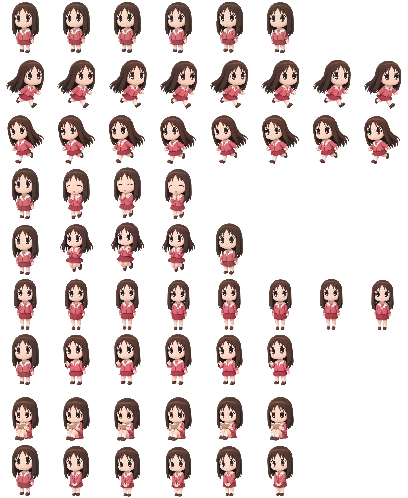

# codexpet-osaka

A slow-reacting chibi Osaka desktop companion for Codex Pet.

This repository contains a small animated desktop-pet asset package inspired by Ayumu Kasuga, commonly known as Osaka, from *Azumanga Daioh*. The goal is to preserve the character’s sleepy, absent-minded, harmless, and “half-a-beat late” personality in a soft 2.5D chibi style.

> This is a fan-made personal project. It is not affiliated with, endorsed by, or sponsored by the original rights holders.

## Features



* Chibi Osaka-style desktop companion
* Transparent animated sprite assets
* Nine-row Codex-compatible animation layout
* Slow, soft, low-energy motion timing
* Multiple interaction states:

  * idle
  * happy
  * shy
  * cry
  * surprised
  * clicked
  * drag
  * sleep
  * study
  * thinking
  * eating
* Packaged `pet.json` and spritesheet assets
* Validation notes for installation and runtime behavior

## Character Direction

The pet is designed around Osaka’s recognizable personality traits:

* slow reaction timing
* vacant forward stare
* soft and harmless expression
* slightly confused but sincere behavior
* quiet, sleepy, naturally funny body language

The animation should feel like a tiny desktop companion that watches, waits, studies, eats, and reacts just a little too late.

## Repository Structure

```text
codexpet-osaka/
├─ README.md
├─ osaka_pet/
│  ├─ package/
│  │  ├─ pet.json
│  │  └─ spritesheet.webp
│  ├─ tests/
│  └─ VALIDATION_REPORT.md
└─ ...
```

Depending on the current build, generated assets may include animation metadata, validation reports, package files, and preview or source-frame directories.

## Installation

Clone the repository:

```powershell
git clone https://github.com/SamuelChann/codexpet-osaka.git
cd codexpet-osaka
```

Install the packaged pet into the local Codex pet directory:

```powershell
New-Item -ItemType Directory -Force "$env:USERPROFILE\.codex\pets\osaka"
Copy-Item -Recurse -Force ".\osaka_pet\package\*" "$env:USERPROFILE\.codex\pets\osaka\"
```

After installation, restart or reload Codex Pet if needed.

## Validation

Run the test suite from the repository root:

```powershell
python -m unittest discover -s osaka_pet\tests -v
```

The validation process checks that the package files are present and that the animation package follows the expected Codex-compatible layout.

## Animation Design

The animation timing is intentionally slow. Reactions usually begin with a short pause before the visible movement happens. This is important to the character identity: Osaka should not feel energetic, sharp, or overly responsive.

Typical state behavior:

| State     | Behavior                                            |
| --------- | --------------------------------------------------- |
| idle      | Slow breathing, delayed blink, vacant stare         |
| happy     | Delayed realization, two soft hops                  |
| shy       | Shrinks slightly, blushes, tiny awkward nod         |
| cry       | Small sobbing motion with stylized tears            |
| surprised | Small pop-up, round eyes, delayed recovery          |
| clicked   | Freezes, slowly raises one hand, confused reaction  |
| drag      | Arms lifted, legs dangling, soft sway               |
| sleep     | Curled or side-lying breathing loop                 |
| study     | Reads, nods, turns page, briefly daydreams          |
| thinking  | Head tilt, blank stare, small question/cloud cue    |
| eating    | Watches food, takes slow bites, tiny satisfied sway |

## Development Notes

The package is designed around a fixed character identity. When editing or extending the pet, avoid regenerating the entire character from scratch unless the master identity is being replaced.

Recommended workflow:

1. Keep the same face, hairstyle, outfit, proportions, and color palette.
2. Modify only the target animation state.
3. Rebuild the spritesheet or package.
4. Run validation.
5. Inspect for face drift, outfit drift, anchor jumps, timing issues, and dirty transparent edges.

## License / Usage

This project is intended as a fan-made local desktop pet asset package. Do not use it in a way that implies official affiliation with *Azumanga Daioh* or its rights holders.

Code and configuration in this repository may be reused for personal desktop-pet experiments, but the character concept and reference identity belong to their respective rights holders.
