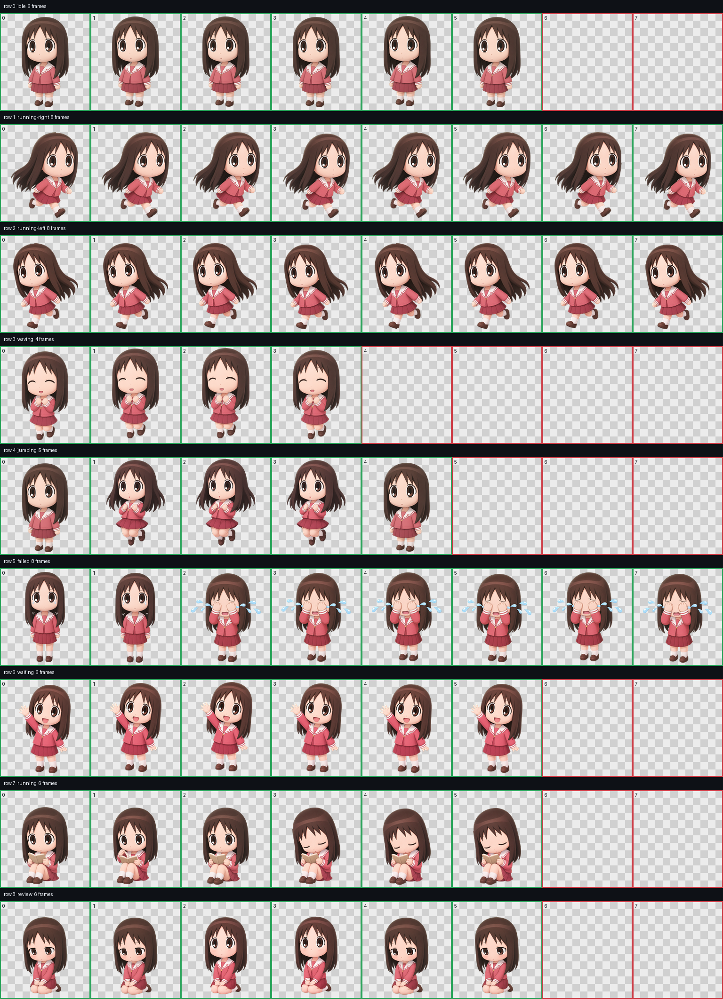

# Codex Pet：大阪

[English](README.md) | [简体中文](README.zh-CN.md) | [日本語](README.ja.md)

一个以大阪（春日步）为角色的 Codex Q 版桌面宠物包。

## 预览



## 文件

- `pet.json`：Codex 自定义桌宠清单。
- `spritesheet.webp`：透明背景动画图集，尺寸为 `1536x1872`。
- `docs/contact-sheet.png`：全部动画状态和帧的预览。

## 安装

将 `pet.json` 和 `spritesheet.webp` 复制到：

```text
%USERPROFILE%\.codex\pets\osaka
```

重启 Codex，然后在桌宠设置中选择 **Osaka**。

## 动画布局

图集遵循 Codex 桌宠固定格式：8 列、9 行，每格 `192x208`。

| 行 | 状态 | 动画 |
| --- | --- | --- |
| 0 | idle | 呼吸与眨眼 |
| 1 | running-right | 被向右拖动 |
| 2 | running-left | 被向左拖动 |
| 3 | waving | 开心挥手 |
| 4 | jumping | 慢半拍的轻柔小跳 |
| 5 | failed | 漫画式捂眼哭泣 |
| 6 | waiting | 张大嘴笑着主动挥手 |
| 7 | running | 看书、翻页和打瞌睡 |
| 8 | review | 跪坐低头并偷偷抬眼 |

## 校验

- WebP / RGBA
- `1536x1872` 图集
- `192x208` 单元格
- 透明背景
